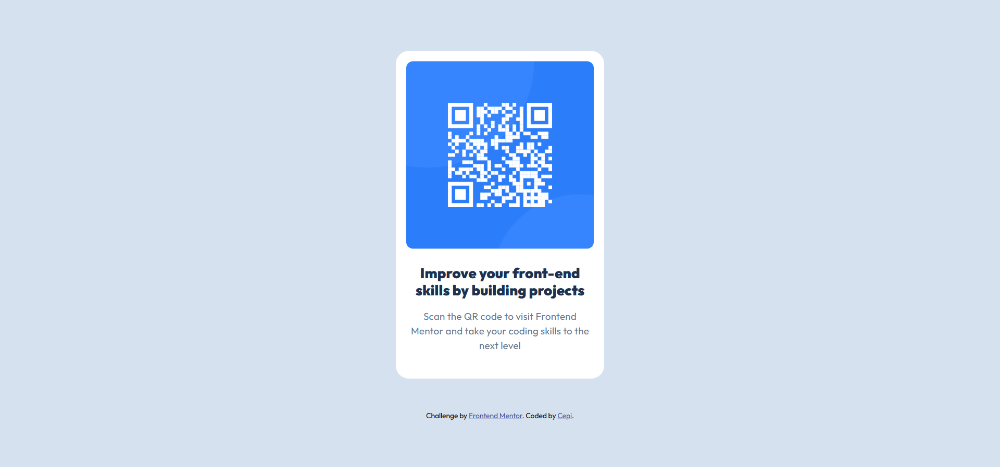

# Frontend Mentor - QR code component solution

This is a solution to the [QR code component challenge on Frontend Mentor](https://www.frontendmentor.io/challenges/qr-code-component-iux_sIO_H).

## Table of contents

- [Overview](#overview)
  - [Screenshot](#screenshot)
  - [Links](#links)
- [My process](#my-process)
  - [Built with](#built-with)
  - [What I learned](#what-i-learned)
  - [Continued development](#continued-development)
  - [AI Collaboration](#ai-collaboration)
- [Author](#author)

---

## Overview

### Screenshot



### Links

- Solution URL: [Add solution URL here](https://your-solution-url.com)
- Live Site URL: [Add live site URL here](https://your-live-site-url.com)

---

## My process

### Built with

- Semantic HTML5 markup
- CSS custom properties (variables)
- Flexbox
- Google Fonts — Outfit
- Mobile-first workflow

### What I learned

Working on this challenge helped me get comfortable with Flexbox for centering content both horizontally and vertically. One thing I'm glad I figured out is using `height: 100vh` on the body combined with `display: flex` to center the card on the page:

```css
body {
  display: flex;
  justify-content: center;
  align-items: center;
  height: 100vh;
}
```

I also practiced using CSS custom properties (variables) for colors, which makes it easier to maintain consistent styles across the project.

### Continued development

In future projects I want to focus on:

- Getting more confident with responsive design and media queries
- Learning more about CSS custom properties and how to organize them
- Practicing accessibility basics — proper alt text, semantic HTML, contrast

### AI Collaboration

I used Claude (claude.ai) as a learning companion during this challenge.

- **How I used it:** Asked for hints when I got stuck, and to explain concepts like Flexbox centering and CSS variables. Claude guided me toward finding solutions rather than giving me the answers directly.
- **What worked well:** Breaking down problems step by step and using analogies to understand the box model and Flexbox really helped things click.
- **What didn't work:** At first I wanted Claude to just give me the CSS — but working through the problems myself made the learning stick much better.

---

## Author

- Frontend Mentor — [@Cepi](https://www.frontendmentor.io/profile/Cepi)
